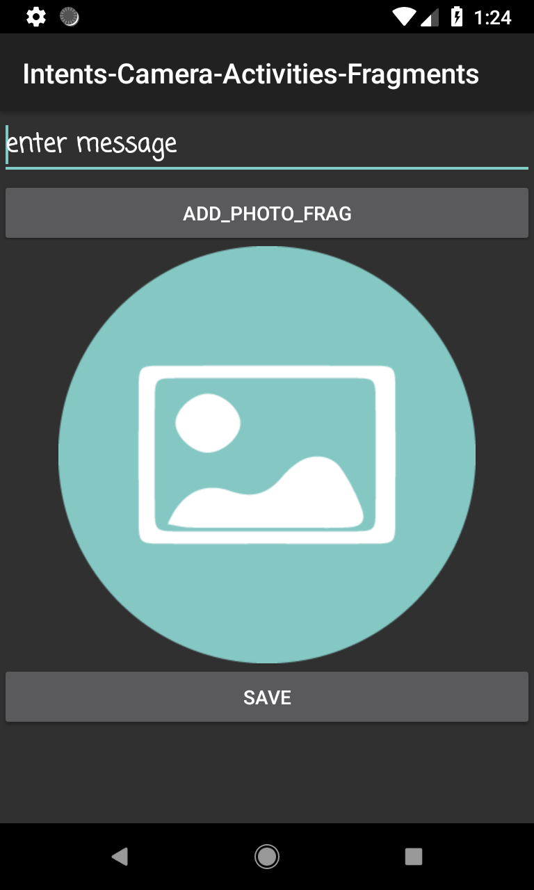
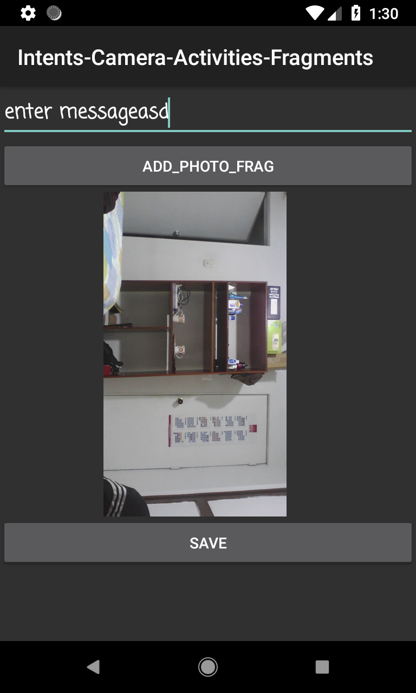

# Android Intents: Camera, Activities and Fragments #

### Part 1: Intents, camera and images 

Create a form that captures a text field and a picture. The picture could be captured using the device's camera or selected from the images stored on the device. In order to give the options to the user you should use a single choice AlertDialog. 

```
     @NonNull
        public static Dialog createSingleChoiceAlertDialog( @NonNull Context context, @Nullable String title,
                                                            @NonNull CharSequence[] items,
                                                            @NonNull DialogInterface.OnClickListener optionSelectedListener,
                                                            @Nullable DialogInterface.OnClickListener cancelListener )
        {
            AlertDialog.Builder builder = new AlertDialog.Builder( context, R.style.My_Dialog );
            builder.setItems( items, optionSelectedListener );
            if ( cancelListener != null )
            {
                builder.setNegativeButton( R.string.Cancel, cancelListener );
            }
            builder.setTitle( title );
            return builder.create();
        }
```

Once the user selects an image it should be displayed in the form (as shown on the screenshot as the Android icon).


#### Form Validation Criteria:

* If the text is empty and no image is selected the following message should be displayed to the user “Please enter either a message or select an image”.
* The text field should have a length longer than 50 characters.
   
Note: You can use the method setError method of the EditText object to display the error message to the user.
      

### Part 2: Activities Intents
       
1) Create a POJO that represents a Post that will contain the data captured in the form (message and imageUri). Make sure the Post class implements the Serializable interface.

2) Create a second Activity named *PostActivity* that will display the saved post. Make sure you include this activity on your *AndroidManifest.xml* file, otherwise you won't be able to start the *PostActivity*. 

3) Create a method that handles the save button onClick event. This method should first trigger the form validation and if the validation is correct then: 
* Create a new intent for the PostActivity created before.
* Create a Bundle object and add the Post object created to this bundle, then add the bundle to the intent as extras.
* Start the new activity using the intent.

This documentation will help you:

https://developer.android.com/training/basics/firstapp/starting-activity.html

       
### Part 3: Using Fragments

1) Create a Fragment called *NewPostFragment*. This should extend the class Support Fragment and contain the same layout and code that you have in the MainActivity to handle the form that captures the photo and a message.

2) Modify the layout of the main activity to have only a Framelayout that fills all the space and has the id *fragment_container*

3) Create another Fragment that contains the logic and layout of the *PostActivity* called *PostFragment*

4) Modify your *MainActivity* and make sure that after the activity is created then your show the NewPostFragment using the following code:

```
   public void showFragment( Fragment fragment, boolean addToBackStack)
    {
        FragmentManager fragmentManager = getSupportFragmentManager();
        FragmentTransaction transaction = fragmentManager.beginTransaction();
    
        String tag = fragment.getClass().getSimpleName();
        if ( addToBackStack )
        {
            transaction.addToBackStack( tag );
        }
        transaction.replace( R.id.fragment_container, fragment, tag );
        transaction.commitAllowingStateLoss();
    }

```
     
 5) Modify the MainActivity so when you click on save you show the *PostFragment* 
 
 6) Verify that the App works as before when you had only activities.
---

# Resultado


---
